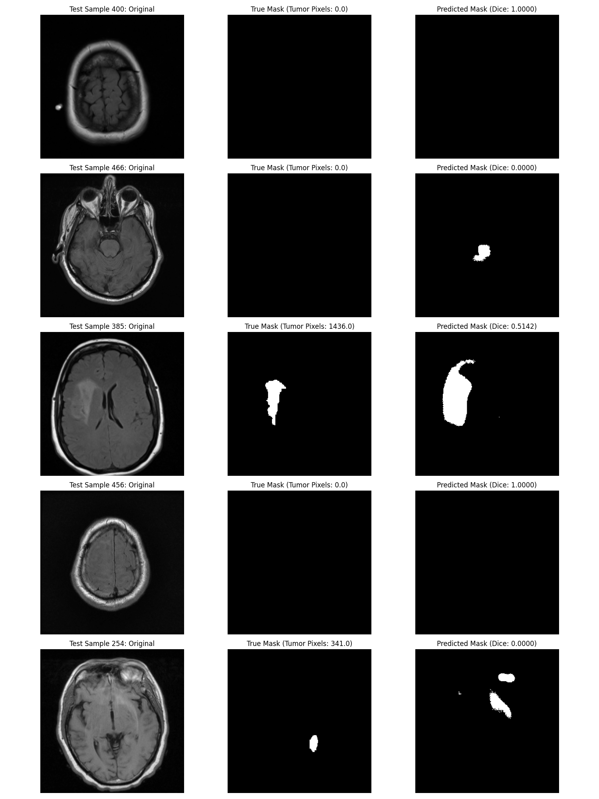

# Brain Tumor Segmentation with U-Net (Ajmal M)

This project implements, ablates, and evaluates U-Net-based deep learning models for brain tumor segmentation on 2D MRI slices, with strict patient-level evaluation and reproducible experiments.

**Final test Dice: 0.329, Recall: 0.44, Precision: 0.38**

---

## Why This Project?

- **Patient-level data splits** (no data leakage—rare in public repos!)
- **Systematic ablation:** BCE, Dice, Combined Loss, various augmentations, threshold tuning, post-processing
- **Full reproducibility:** all code, configs, and results included
- **Honest reporting:** both positive and negative results

---

## What I Did

- Refactored data pipeline for patient-level splits
- Implemented and compared multiple loss functions
- Designed and visualized multiple augmentation strategies (basic, advanced, mild)
- Added post-processing to reduce false positives
- Ran and documented full ablation studies
- All code, results, and figures are my own

---

## Results (Test Set)

| Model Variant                | Dice  | Jaccard | Recall | Precision |
|------------------------------|-------|---------|--------|-----------|
| BCE only                     | 0.48  | 0.40    | 0.46   | 0.61      |
| Combined Loss, No Aug        | 0.47  | 0.36    | 0.54   | 0.49      |
| Combined Loss, Basic Aug     | 0.44  | 0.33    | 0.56   | 0.43      |
| Combined Loss, Adv Aug       | 0.39  | 0.28    | 0.49   | 0.46      |
| **Combined Loss, Mild Aug**  | **0.33** | 0.24 | 0.44 | 0.38      |

---

## Sample Predictions



---

## How to Run

1. Clone this repo and install requirements:
    ```
    git clone <your-repo-link>
    cd brain-tumor-segmentation-unet
    pip install -r requirements.txt
    ```

2. Preprocess data:
    ```
    python preprocess_data.py
    ```

3. Train model:
    ```
    python train_unet.py
    ```

4. Evaluate on test set:
    ```
    python evaluate_model.py
    ```

---

## Project Structure

- `preprocess_data.py` — Data loading and patient-level splitting
- `train_unet.py` — Model training with augmentation
- `evaluate_model.py` — Evaluation and visualization
- `trained_models/` — Saved models and plots
- `data_processed/` — Preprocessed data splits

---

## What’s Next

- Try Attention U-Net or nnU-Net
- Experiment with multi-modal or 3D data
- Submit to a workshop or as a preprint

---

## Credits

This project was originally forked from [original author/repo link].  
All new experiments, results, and documentation are by Ajmal M.

---

## Contact

Ajmal M  
[LinkedIn]([(https://www.linkedin.com/in/ajmal-m-282670284/)]) | [GitHub](https://github.com/AjmalMIITM)
